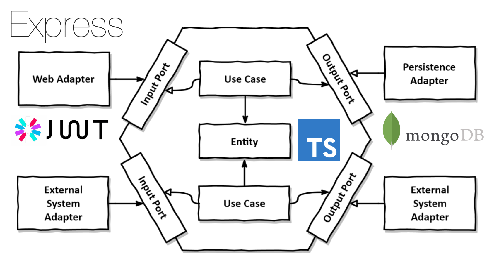

# Personal blog Backend

## App Architecture

## Available Scripts

### `yarn run start:dev`

Runs the app in development mode.

### `yarn run start`

Runs the app in production mode.

### `yarn run build`

Builds the app for production to the `build` folder.

### `yarn run test`

Run all the tests of the app.

### `yarn run lint`

Execute eslint check.
